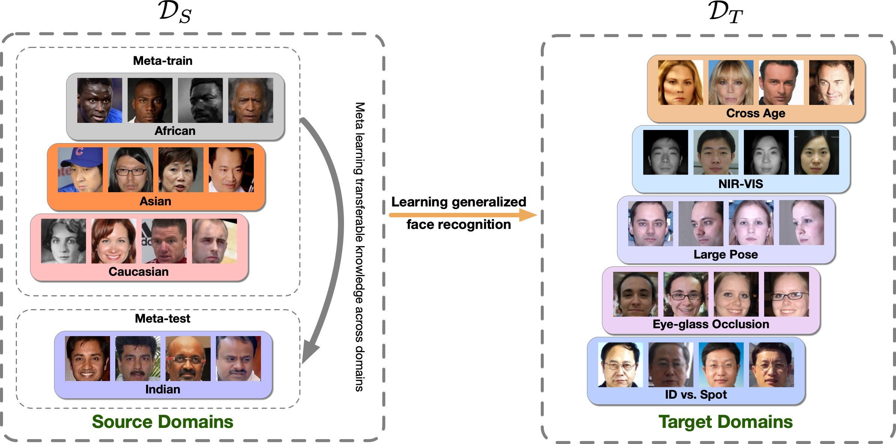
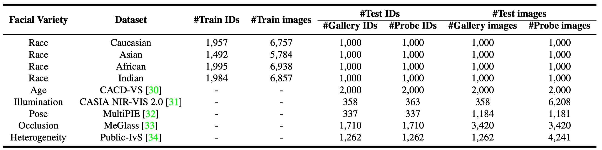
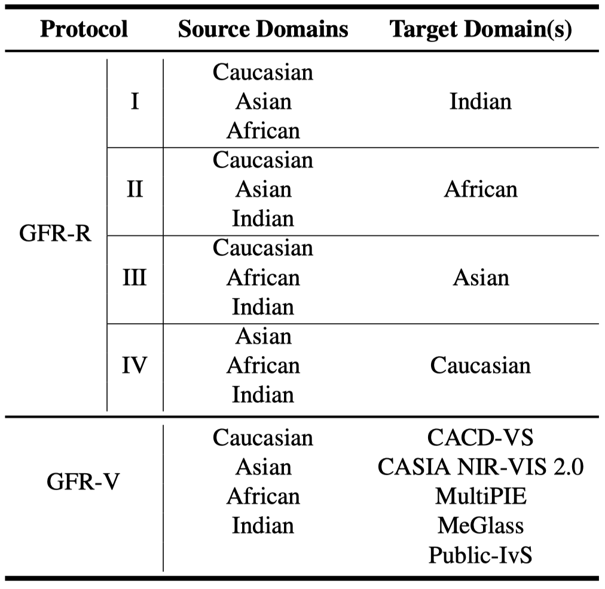
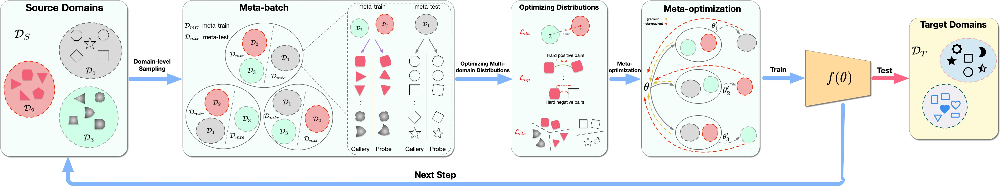
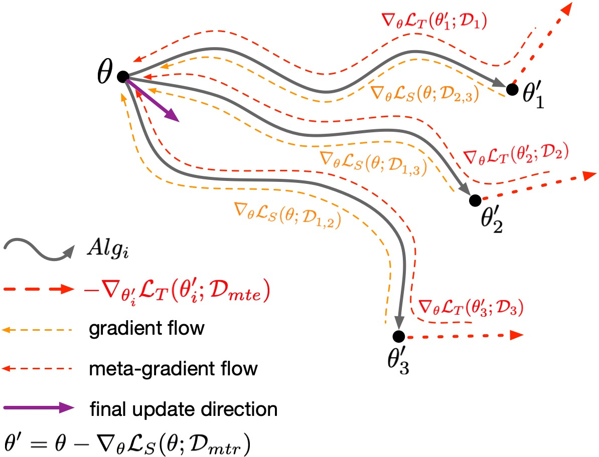

# Learning Meta Face Recognition in Unseen Domains

By [Jianzhu Guo](https://me.guojianzhu.com), [Xiangyu Zhu](http://www.cbsr.ia.ac.cn/users/xiangyuzhu/), [Chenxu Zhao](https://www.linkedin.com/in/chenxu-zhao-b66844107/), Dong Cao, [Zhen Lei](http://www.cbsr.ia.ac.cn/users/zlei/) and [Stan Z. Li](http://www.cbsr.ia.ac.cn/users/szli/).

**\[Todo\]**

- [ ] Release the images of the GFR-R and GFR-V benchmark.
- [ ] Release the evaluation code.

## Introduction

This repo will release the two proposed benchmarks GFR-R and GFR-V in our paper. I hope the proposed benchmarks will attract researchers on _Generalized Face Recognition_ problem. More details can be referred to our paper [Learning Meta Face Recognition in Unseen Domains](https://me.guojianzhu.com/assets/pdfs/05997.pdf), accepted to CVPR2020.

### GFR Problem
_What is GFR (Generalized Face Recognition) problem?_

In real-world applications of face recognition, the model trained on source domains DS is usually deployed in another domain DT with a different distribution. If the target domain DT is known and the data is accessible, it is categorized into domain adaptation for face recognition. If the target domain is unseen, it can be regarded as domain generalization for face recognition, and we call it Generalized Face Recognition, which is more common as the trained model is usually deployed in unknown scenarios and faced with unseen data. As shown below, the deployed model should be able to generalize to unseen domains without any updating or fine-tuning.

  

### GFR-R and GFR-V Benchmark
GFR-R is for crossing race evaluation and GFR-V is crossing facial variety, which means a large gap between source domains and target unseen domains. The involved datasets and protocols are shown in two tables below.

  

  

### Our Method
Our proposed method are inspired by MAML, shown in the figure below.

  

The meta-optimization procedure:

  

Please see [our paper](https://me.guojianzhu.com/assets/pdfs/05997.pdf) for more details.

## Citation

    @article{guo2020learning,
        title   =   {Learning Meta Face Recognition in Unseen Domains},
        author  =   {Guo, Jianzhu and Zhu, Xiangyu and Zhao, Chenxu and Cao, Dong and Lei, Zhen and Li, Stan Z},
        journal =   {arXiv preprint arXiv:2003.07733},
        year    =   {2020}
    }

<!-- **This repo will keep updating.** -->